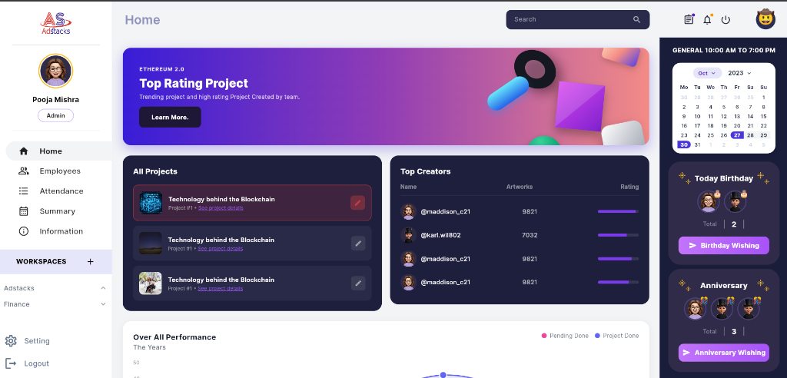
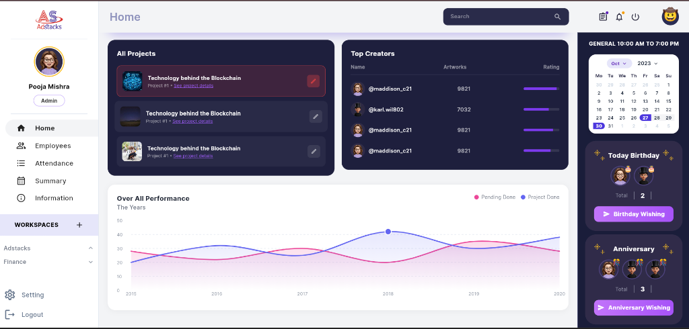
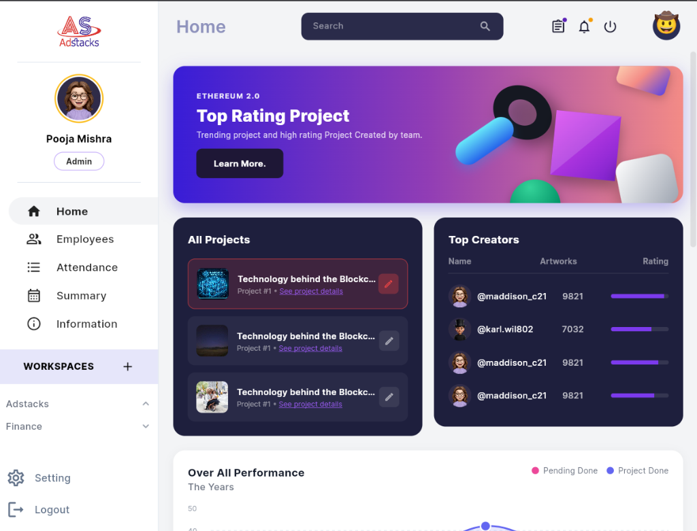
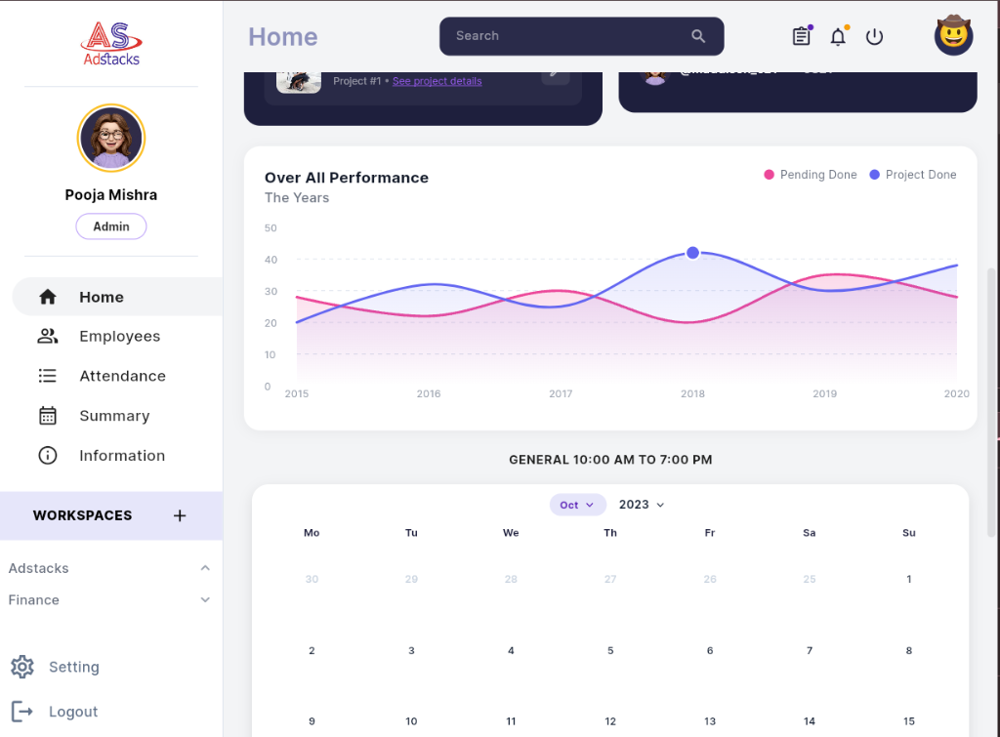
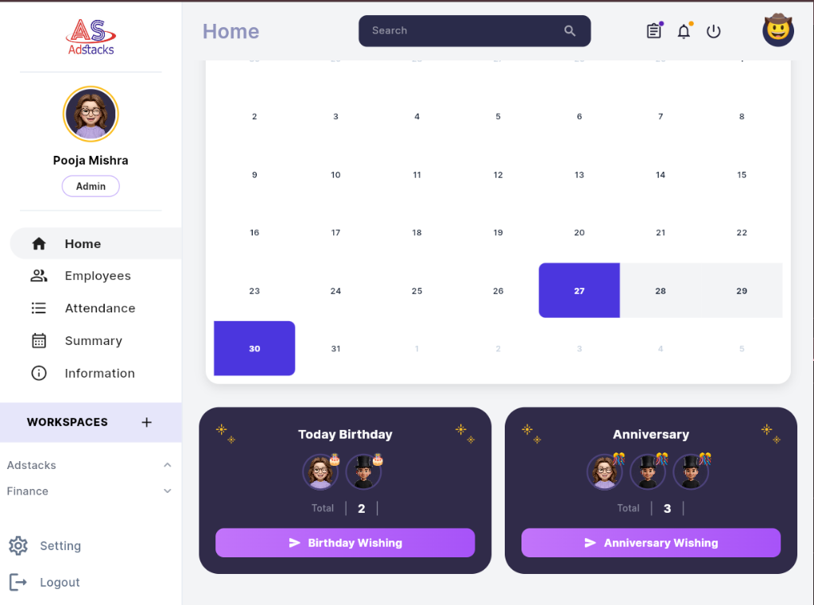
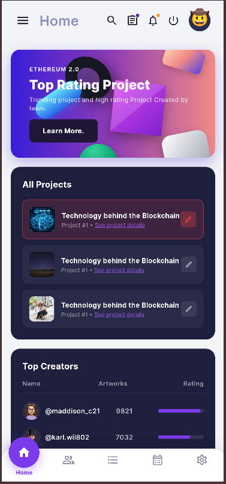
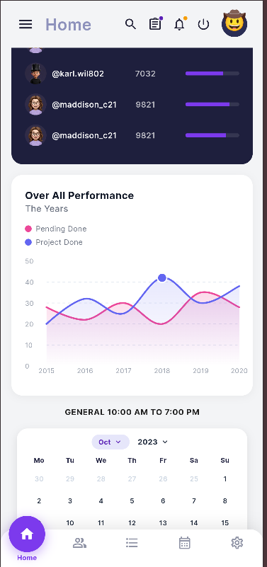
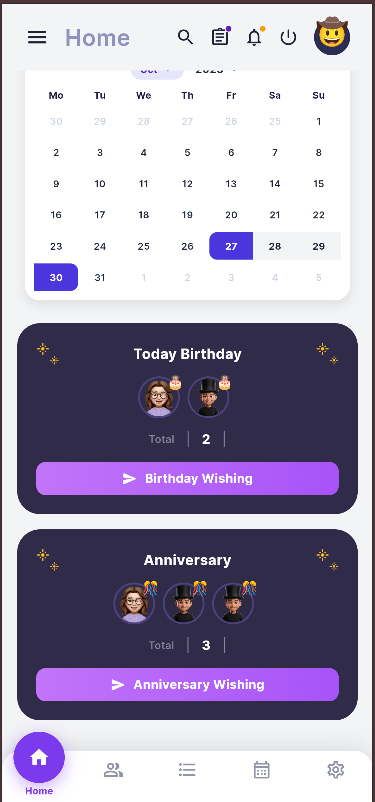
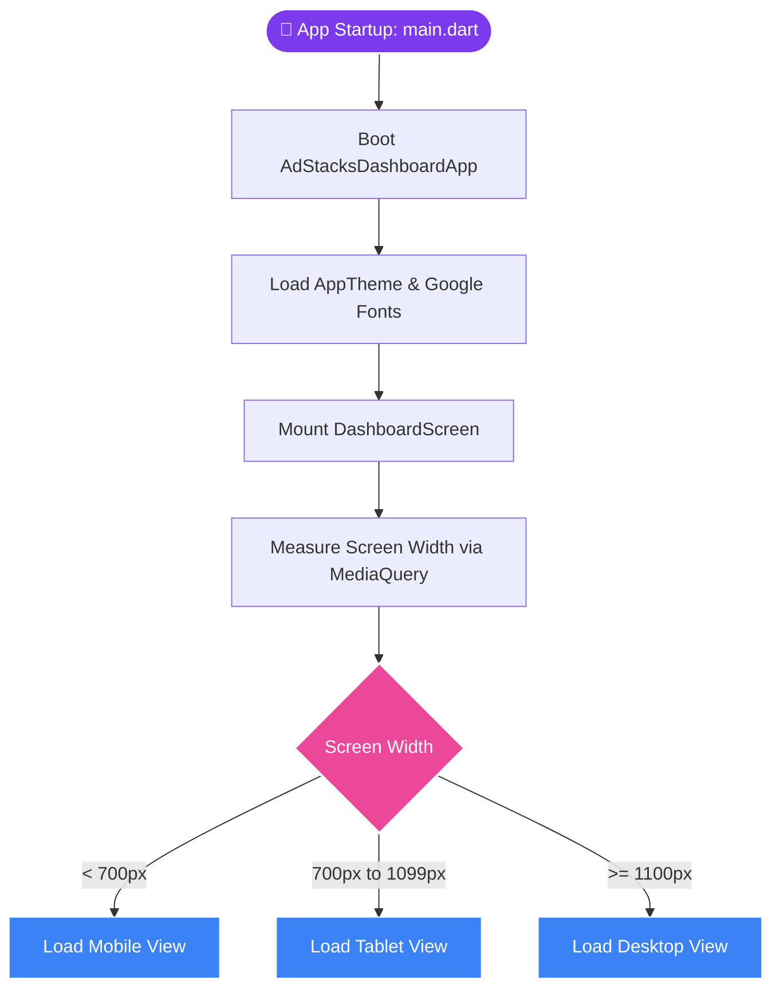
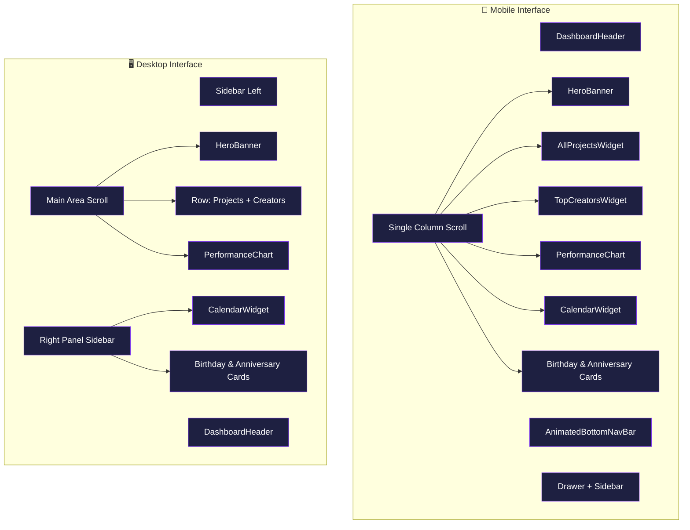

# 🌌 AdStacks Media Office Dashboard

<p align="center">
  
</p>

<p align="center">
  <b>🌌 Creative operations dashboard for modern media agencies. Built with Flutter, powered by Firebase.</b>
</p>

<p align="center">
  <a href="#-quick-start">🚀 Quick Start</a> •
  <a href="#-responsive-showcase">📱 Device Layouts</a> •
  <a href="#-feature-matrix">🌟 Features</a> •
  <a href="#-architecture">🛠️ System Architecture</a> •
  <a href="https://dashboard-b52dc.web.app/">✨ Live Demo</a>
</p>

<p align="center">
  
  &nbsp;
  
  &nbsp;
  
  &nbsp;
  
</p>

---

## ⚡ Quick Experience

Experience the live workspace application in your browser instantly:

> [!TIP]
> ### 🔗 **[Explore Live Demo](https://dashboard-b52dc.web.app/)**
> *Interact with animations, check the responsiveness on your browser/mobile device, and see the interactive charts.*

---

## 🎨 UI Blueprint & Design Philosophy

The dashboard is crafted as a **Premium Workspace Interface** prioritizing readability, clean visual contrast, and high-fidelity animations.

```
┌────────────────────────────────────────────────────────┐
│                        HEADER                          │
├───────────────┬────────────────────────┬───────────────┤
│               │   HERO WELCOME BANNER  │               │
│               ├───────────┬────────────┤               │
│               │ PROJECTS  │ CREATORS   │   CALENDAR    │
│    SIDEBAR    ├───────────┴────────────┤               │
│               │      PERFORMANCE       │  CELEBRATIONS │
│               │         CHART          │               │
└───────────────┴────────────────────────┴───────────────┘
```

### 💎 Key Visual Characteristics

*   **Tailored Color Tokens:** Seamless integration of `#7C3AED` (Deep Violet) and `#EC4899` (Vibrant Pink) accents over clean card surfaces.
*   **Context-Aware Dark-Mode Blocks:** The calendar widget and celebration cards use high-contrast dark interfaces (`#1E1F3D`) to separate real-time events from historical metrics.
*   **Touch-Responsive Physics:** Interactive buttons and lists integrate custom elastic springs, creating micro-bounces when tapped.

---

## 📱 Responsive Device Layouts

The dashboard adapts dynamically across viewport breakpoints to guarantee layout balance and readability. Below is the layout comparison showing the primary canvas and its scrolled/extended states side-by-side:

### 🖥️ Desktop Layouts (Primary vs. Extended View)
*Shows the default dashboard view (left) and the scrolled bottom panel showing the line chart (right).*
<table width="100%">
  <tr>
    <td width="50%" align="center"><b>1. Primary Control Dashboard</b></td>
    <td width="50%" align="center"><b>2. Extended Performance Dashboard</b></td>
  </tr>
  <tr>
    <td valign="top"></td>
    <td valign="top"></td>
  </tr>
</table>

---

### 📐 Tablet Layouts (Standard vs. Scroll States)
*Shows the standard layout (left), scrolled top section (center), and scrolled bottom section (right).*
<table width="100%">
  <tr>
    <td width="33.3%" align="center"><b>1. Standard Canvas</b></td>
    <td width="33.3%" align="center"><b>2. Scroll State (Top)</b></td>
    <td width="33.3%" align="center"><b>3. Scroll State (Bottom)</b></td>
  </tr>
  <tr>
    <td valign="top"></td>
    <td valign="top"></td>
    <td valign="top"></td>
  </tr>
</table>

---

### 📱 Mobile Layouts (Native vs. Scroll States)
*Shows the default viewport (left), scrolled creators section (center), and scrolled calendar & celebrations (right).*
<table width="100%">
  <tr>
    <td width="33.3%" align="center"><b>1. Native Viewport</b></td>
    <td width="33.3%" align="center"><b>2. Scroll State (Top)</b></td>
    <td width="33.3%" align="center"><b>3. Scroll State (Bottom)</b></td>
  </tr>
  <tr>
    <td valign="top"></td>
    <td valign="top"></td>
    <td valign="top"></td>
  </tr>
</table>

---

## 🌟 Feature Matrix

We designed the dashboard with components divided into operational and statistics areas:

| Operational Cards | Analytics & Scheduling | Core Animations |
| :--- | :--- | :--- |
| 📂 **Active Project Directory**<br>Live trackers showing progress metrics. | 📈 **Overall Performance Chart**<br>Custom interactive graphs built via `fl_chart`. | 🔄 **Elastic Spring Effects**<br>Custom bouncing controllers for physical touch feedback. |
| 🏆 **Creators Leaderboard**<br>Rankings of top creators showing ratings. | 📅 **Dark Panel Calendar**<br>Clean calendar view separated by a high-contrast theme. | 💬 **Water Drop Bottom Bar**<br>Smooth animations that transition between viewports. |
| 🎉 **Celebration Hub**<br>Highlights birth dates and work anniversaries. | 🔍 **Universal Search**<br>Clean, search bar header for queries. | 🌌 **Responsive Layout Engine**<br>Adapts instantly between desktop, tablet, and mobile. |

---

## 🛠️ Project Architecture

A clean mapping of the code organization, showing how themes, screens, and components work together:

```
lib/
├── 📄 main.dart                 # Application entry point & Theme Bootstrapper
│
├── 📂 theme/                    # Color tokens and stylesheet systems
│   ├── 📄 app_colors.dart       # Design systems hex values & gradients
│   └── 📄 app_theme.dart        # Global Material 3 configurations
│
├── 📂 models/                   # Project models and datasets
│   └── 📄 data_models.dart      # Creators, Projects, and BirthdayPerson definitions
│
├── 📂 screens/                  # Core layouts
│   └── 📄 dashboard_screen.dart # Responsive grid builder with viewport breakpoints
│
└── 📂 widgets/                  # Modular screen blocks
    ├── 📄 sidebar.dart               # Responsive desktop drawer menu
    ├── 📄 dashboard_header.dart      # Navigation header & global search bar
    ├── 📄 hero_banner.dart           # Spotlit gradient welcome card
    ├── 📄 all_projects_widget.dart   # Ongoing project progress boards
    ├── 📄 top_creators_widget.dart   # Ranked employee leaderboard card
    ├── 📄 performance_chart.dart     # Interactive fl_chart analytics
    ├── 📄 calendar_widget.dart       # Dark panel event calendar
    ├── 📄 celebration_cards.dart     # Birthday & anniversary cards
    └── 📄 animated_bottom_navbar.dart # High-fidelity mobile nav bubble bar
```

---

## ⚙️ Application Flow & Lifecycle

The dashboard utilizes a reactive, breakpoint-driven architecture. Below are the functional flowcharts showing application startup, responsive layout selection, and layout state components:

### 1. App Startup & Responsive Routing Flow
*Details how the app bootstraps themes and determines the correct layout view based on device screen dimensions.*



### 2. Multi-Layout Component Distribution
*Maps how layout components and child widgets are loaded based on the resolved responsive layout state.*



---

## ⚙️ Installation & Running

### 📋 Prerequisites

Ensure you have installed the **[Flutter SDK (v3.10.7+)](https://docs.flutter.dev/get-started/install)**.

### 🚀 Running Locally

Follow these quick commands to build and boot the web application:

1. **Clone the code:**
   ```bash
   git clone https://github.com/Subrata0Ghosh/flutter-dashboard.git
   cd flutter-dashboard
   ```

2. **Acquire libraries:**
   ```bash
   flutter pub get
   ```

3. **Run on Local Chrome Host:**
   ```bash
   flutter run -d chrome
   ```

---

## 🌐 Deploy to Firebase Hosting

Deploy changes live using the built-in Firebase configurations:

```bash
# 1. Compile optimized web assets
flutter build web --release

# 2. Deploy to live Firebase instance
firebase deploy
```

---

## 📝 License

Distributed under the **MIT License**. Check out `LICENSE` for details.
